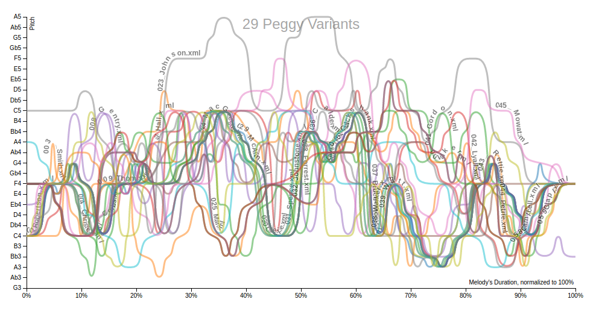
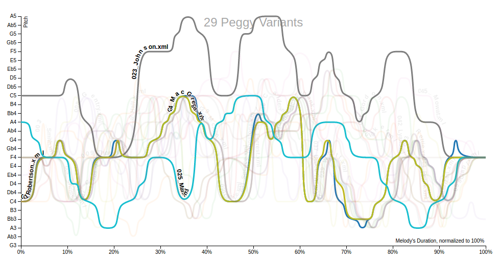

ContourViz
--------
This is a modification of the contourviz package, whose original readme can be found on the original github page at https://github.com/cjwit/contourviz. It uses music21 to chart monophonic melodies within a set ambitus. This modification was built specifially to model variants of British folk songs for an undergraduate music thesis; thus, it has some specific quirks which will be annoying to someone who is trying to use it for not modelling the exact melodies for which it was built.

This modification charts pitches by pitch name, rather than frequency. The advantage of this is that it is much more human-readable. The disadvantage is that the pitch names are manually assigned only to pitches within the ambitus of the melodies I was analyzing. To change this, you'll have to edit the contourviz.py file and also the script.js file in the generated results/ directory. 

This modification is designed for use with Python 3. You need to have Python 3 installed to use it. The original version works only with Python 2. 

To see some results sorted by different categories, see http://www.carolineglazer.com/peggy/. Some examples:

Contour map example for 29 variants of the folk song "Peggy-O", or "The Bonnie Lass O' Fyvie"

Same contour map with 4 different variants highlighted

To install (the original countourviz package, NOT this version):

    >>> pip install contourviz

To install this version:

   >>> # Clone this git repository.
   >>> git clone https://github.com/carolineglazer/contourviz.git
   >>> cd contourviz
   >>> 
   >>> # Build the python module
   >>> sudo python3 setup.py install

To use on the command line:

    >>> # Navigate to an empty directory (or at least one without a folder called 'results')
    >>> # Create a chart of multiple melodic contours
    >>> chart-contours '/path/to/directory/full/of/xml/or/mxl/files'
    >>>
    >>> # Create a chart of a single melodic contour
    >>> chart-single-contour '/path/to/file.xml'

For use within the Python interpreter:

    >>> # Navigate to an empty directory (or at least one without a folder called 'results')
    >>> testFile = '/path/to/file.xml'
    >>> testPath = '/path/to/directory/full/of/xml/or/mxl/files'
    >>>
    >>> # Create a single contour line from a given file
    >>> createDataFromFile(testFile)
    >>>
    >>> # Create a set of contour lines from all files in a given directory
    >>> createDataFromDirectory(testPath)
